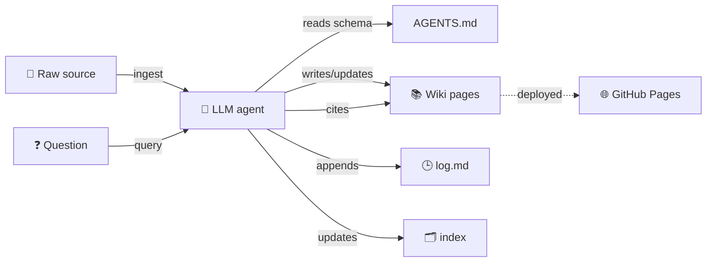

# Kunal's AI Knowledge Base

A personal, **LLM-maintained** wiki on AI topics — following [Karpathy's pattern][karpathy] for persistent, compounding knowledge bases.

[karpathy]: https://gist.github.com/karpathy/442a6bf555914893e9891c11519de94f

!!! note "Not RAG. Not a notes folder."
    A persistent, interlinked artifact that an LLM agent maintains over time. **I curate sources and ask questions; the LLM does the bookkeeping** — summarizing, linking, filing, lint.

## Browse

-   :material-lightbulb: **Concepts**

    ---

    Ideas, frameworks, patterns

    - [LLM wiki for agents](concepts/llm-wiki-for-agents.md)
    - [Agent memory types](concepts/agent-memory-types.md) — procedural & episodic
    - [Spec Kit for vibe coding](concepts/spec-kit-for-vibe-coding.md)

-   :material-clipboard-text: **Playbooks**

    ---

    Reusable frameworks for prototyping & decisions

    - [Context doc for prototyping](playbooks/context-doc-for-prototyping.md) — JTBD-style 6-question framework

-   :material-account-multiple: **Entities**

    ---

    Tools, people, companies, models

    _(none yet — added as they emerge)_

-   :material-bookshelf: **Sources**

    ---

    Per-source summary pages from ingested documents

    _(none ingested yet)_

## How this works

**Three layers** (per Karpathy):

| Layer | Owns | Mutability |
|---|---|---|
| **Raw sources** (`raw/`) | Me (curator) | Immutable — LLM reads, never writes |
| **Wiki** (`wiki/`) | The LLM | LLM creates/updates pages, maintains cross-refs |
| **Schema** ([AGENTS.md](https://github.com/kunalprakashm/ai-kb/blob/main/AGENTS.md)) | Co-evolved | Conventions, workflows, page formats |

Two navigation files: **`index.md`** (this page — content catalog) and **[`log.md`](https://github.com/kunalprakashm/ai-kb/blob/main/log.md)** (chronological log of every ingest, query, lint).

## How to add a new topic

1. **Drop a source** in `raw/` (article, paper, transcript, PDF)
2. Tell your LLM agent: *"Read `AGENTS.md`, then ingest `raw/<filename>`."*
3. The agent integrates it — creates a source page, updates relevant concept/entity pages, adds cross-references, appends to the log
4. **Push to `main`** → GitHub Actions rebuilds this site automatically

To create a topic without a source (just from prior knowledge / conversation), ask:
*"Create a concept page on <topic>, drawing on what we've discussed."*

## Repo

[**kunalprakashm/ai-kb**](https://github.com/kunalprakashm/ai-kb) · [Latest activity (log.md)](https://github.com/kunalprakashm/ai-kb/blob/main/log.md) · [Schema (AGENTS.md)](https://github.com/kunalprakashm/ai-kb/blob/main/AGENTS.md)
